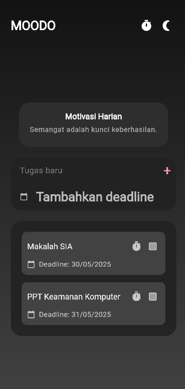
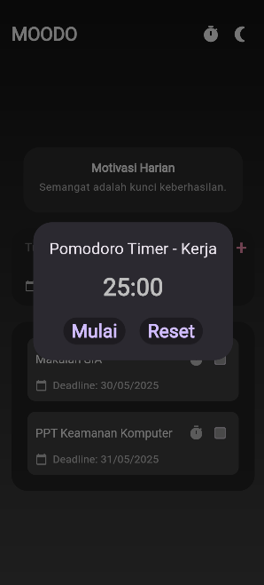

# Biodata Mahasiswa

Nama : Ahmad Wahyu Apryanto  
NIM : 2022804098  
Jurusan : Sistem Informasi
Semester : 6 

  
  
 

#MOODO App
**Aplikasi Pencatatan Tugas dengan Motivasi & Pomodoro Timer**  
MOODO membantu Anda mencatat tugas sambil memberikan motivasi random setiap kali membuka/menyelesaikan tugas, dilengkapi Pomodoro Timer untuk fokus optimal.

## 📌 Fitur Utama
1. **Pencatatan Tugas**
    - Tambah, edit, hapus, dan tandai tugas sebagai selesai.
    - Membuat Deadline

2. **Kata-Kata Motivasi Random**
    - Motivasi muncul otomatis saat:
        - Membuka aplikasi.
        - Menyelesaikan tugas.

3. **Pomodoro Timer ⏳**
    - Timer 25 menit (fokus) + 5 menit (istirahat).
    - Notifikasi saat sesi berakhir.

4. **Tema Personalisasi**
    - Pilih tema terang/gelap.
    - Animasi interaktif  
